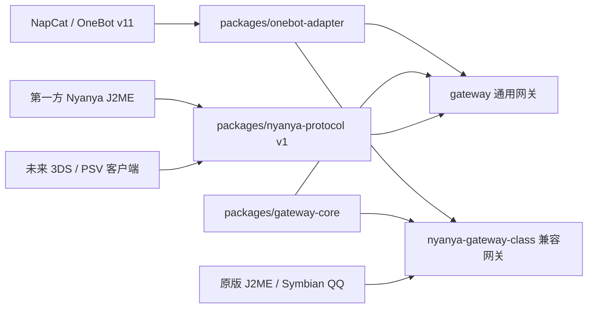

# Nyanya Gateway 架构

Nyanya Gateway 将 NapCat/OneBot 与不同年代、不同平台的客户端隔离开。QQ 上联、领域模型和客户端协议各自只有一份实现。

## 模块边界

- `packages/onebot-adapter/`：唯一的 NapCat/OneBot WebSocket 实现，负责 action 调用、事件接收和重连。
- `packages/gateway-core/`：协议无关的联系人、群、消息、发送路由、限频、会话、历史和离线投递模型。
- `packages/nyanya-protocol/`：第一方客户端使用的版本化 LAN 协议、AUTH 能力协商和跨语言黄金向量。
- `gateway/`：把 Nyanya Protocol 帧转换为共享核心操作，不包含旧 QQ 命令。
- `nyanya-gateway-class/`：把共享核心对象转换为原版 QQ 二进制协议，独立维护 QQ-TEA、JCE/WUP、旧命令和 SQLite。
- `clients/`：第一方 Nyanya 客户端，不直接接触 NapCat/OneBot。

旧 QQ 的命令号、分页限制和 Symbian/J2ME 机型兼容策略不得进入通用协议；第一方客户端的平台差异通过 capability 表达。

## 运行与数据

两个网关是独立进程，默认都使用 TCP 14000，因此通常不能同时以默认配置启动。

- 通用网关配置：`gateway/config.json`；默认不创建持久化数据库。
- 兼容网关配置：`nyanya-gateway-class/config.json`。
- 兼容网关数据：`nyanya-gateway-class/nyanya-data/`，包含 SQLite、WAL、日志、PID 和本地媒体。

配置、数据和源码严格分开。发布包只提供 `config.example.json`，不会复制开发机的配置或运行数据。

### 部署形态

兼容网关支持两种形态，代码本身不变，差异只在配置和拓扑：

- **局域网形态（默认）**：手机、网关、NapCat 处于同一网络，网关用自动探测到的局域网 IP 回给客户端。
- **网关上云 + NapCat 留家里**：网关跑在有公网 IP 的服务器上，NapCat 留在家中电脑，两者用 SSH 反向隧道（或 frp / WireGuard）相连。此时必须显式配置 `mediaPublicHost` 与 `loginPublicHost`（服务器上自动探测会挑到虚拟网卡的内网地址），`onebotUrl` 指向隧道入口。详细步骤见源码仓库及 Class 发布包内的 `nyanya-gateway-class/异地部署.md`。

绑定到 `127.0.0.1` 的管理页（13980）和隧道入口（3001）在任何形态下都不应直接暴露；老 QQ 协议是明文且登录摘要可重放，公网形态必须自行补齐防火墙 / IP 白名单。

## 协议与版本

当前产品版本为 0.1.0。第一方 Nyanya 线协议为 v1，对应 `@nyanya/protocol` 1.0.0；Gateway Class 不使用该协议。具体组合见 [版本矩阵](docs/版本矩阵.md)。

协议升级遵循以下原则：

- v1 帧头、Type 数值和既有字段含义保持稳定；
- 新的可选能力先通过 AUTH capability 协商；
- 无法保持语义兼容时提升协议版本；
- Node 与客户端实现必须共同通过 `vectors/v1.tsv` 黄金向量。

## 发布边界

- `Nyanya-Gateway-vX.Y.Z`：通用网关、三个共享包、使用教程和 Nyanya 协议文档。
- `Nyanya-Gateway-Class-vX.Y.Z`：兼容网关、Gateway Core、OneBot Adapter 和使用教程。

两个包都排除生产配置、运行数据、历史迁移记录和逆向研究材料。
